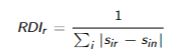

```{r}
suppressPackageStartupMessages({
library(PxWebApiData)
library(dplyr)
library(tidyverse)
library(lubridate)
library(REAT)
})
knitr::opts_chunk$set(echo = FALSE, include = FALSE)
```

# 2. Mål for beskrivelse av næringsstrukturen.

```{r hente datasett}
Haug_arbeid <- read_csv("Data/Haug_arbeid.csv") 
Sunn_arbeid <- read_csv("Data/Sunn_arbeid.csv")
```

```{r rydde datasett H}
Haug_arbeid_punkt2 = mutate(Haug_arbeid, tot_H = Haugesund+Sauda+Bokn+Tysvaer+Karmoey+Utsira+Vindafjord)
Haug_arbeid_punkt2 = filter(Haug_arbeid_punkt2, Alder == c("15-74"))
```

```{r rydde datasett S}
names(Sunn_arbeid)[[13]] <- "Odda_og_Ullensvang"
Sunn_arbeid_punkt2 = mutate(Sunn_arbeid, tot_S =  Etne+Sveio+Boemlo+Stord+Fitjar+Tysnes+Kvinnherad+Odda_og_Ullensvang)
Sunn_arbeid_punkt2 = filter(Sunn_arbeid_punkt2, Alder == c("15-74"))
```

```{r left_join}
arbeid_punkt2_first = left_join(Haug_arbeid_punkt2, Sunn_arbeid_punkt2)
```

```{r legge inn total av alle kommuner}
arbeid_punkt2 =mutate(arbeid_punkt2_first, tot = tot_H+tot_S)
```

```{r rydde}
rm (arbeid_punkt2_first, Haug_arbeid, Sunn_arbeid)
```

%\>%

## Lokaliseringskvotienter

### Haugesund: 05-09 Bergverksdrift og utvinning

```{r df 2008}
df2008 = filter(arbeid_punkt2, Aar == c("2008"))
```

```{r 2008}
locq(452, 21322, 1338, 47530, industry.names = Bergverksdrift_utvinning_2008, plot.results = FALSE,
LQ.method = "m", plot.title = "Localization quotients", 
bar.col = "lightblue", line.col = "red", arg.size = 1)
```

```{r df 2014}
df2014 = filter(arbeid_punkt2, Aar == c("2014"))
```

```{r 2014}
locq(416, 22190, 1521, 49518, industry.names = Bergverksdrift_utvinning_2014, plot.results = FALSE,
LQ.method = "m", plot.title = "Localization quotients", 
bar.col = "lightblue", line.col = "red", arg.size = 1)
```

```{r df 2019}
df2019 = filter(arbeid_punkt2, Aar == c("2019"))
```

```{r 2019}
locq(685, 21429, 1752, 49295, industry.names = Bergverksdrift_utvinning_2020, plot.results = FALSE,
LQ.method = "m", plot.title = "Localization quotients", 
bar.col = "lightblue", line.col = "red", arg.size = 1)
```

Her har vi beregnet lokaliseringskvotient for næringen "bergverksdrift
og utvinning" med NACE-kode 05-09. Den beregnes slik: (sysselsetting i
gitt bransje i Haugesund/total sysselsetting i Haugesund)/(sysselsetting
i gitt bransje i alle kommunene/sysselsetting i alle kommunene vi har
med i oppgaven vår).

Som vi kan se har lokaliseringskvotienten her endret seg noe med tiden.
Dette tolker vi som at konsentrasjonen av industrien (bergverksdrift og
utvinning) i Haugesund er i endring, men fordi tallet hele tiden er
lavere enn 1, kan vi se at industrien er underrepresentert i Haugesund,
målt opp mot hele området vårt (alle kommunene i vårt datasett). For
eksempel vil tallet 0.8994 si at i Haugesund er det målt opp mot området
i helhet, 89% arbeidsplasser innenfor bransjen.

Det er flere grunner til at lokaliseringskvotienten endrer seg. En kan
være at antall sysselsatte innenfor næringer øker i kommunen, eller at
totalt antall i næringen i regionen minker.

### Haugesund: 86-88 Helse- og sosialtjenester

(første tall/3. tall)-(andre tall/fjerde tall)

```{r}
locq(4812, 21322, 9596, 47530, industry.names = Helse_og_sosialtjen_2008, plot.results = FALSE,
LQ.method = "m", plot.title = "Localization quotients", 
bar.col = "lightblue", line.col = "red", arg.size = 1)
```

```{r}
locq(5096, 22190, 10425, 49518, industry.names = Helse_og_sosialtjen_2014, plot.results = FALSE,
LQ.method = "m", plot.title = "Localization quotients", 
bar.col = "lightblue", line.col = "red", arg.size = 1)
```

```{r}
locq(5608, 21429, 11050, 49295, industry.names = Helse_og_sosialtjen_2019, plot.results = FALSE,
LQ.method = "m", plot.title = "Localization quotients", 
bar.col = "lightblue", line.col = "red", arg.size = 1)
```

Resultatene til lokaliseringskvotientene for næringen helse- og
sosialtjenester i Haugesund fremviser en relativt stabil utvikling over
tidsperioden 2008-2019. Verdien i 2008 lå på 1,12, hvor den sank til
1,09 i 2014 og steg igjen til 1,17 i 2019. Fra formelen for
lokaliseringskvotienter så vet vi at den øverste brøken vil da
representere helse- og sosialtjenester sin andel for total sysselsetting
i regionen og i nevner helse-og sosialtjenester sin andel av total
sysselsetting for nasjonen. Siden tallet har ligget stabilt over 1 så
reflekterer det at denne type aktiviteter er viktigere for regionen, enn
for landet. Noe som potensielt kan antyde på at Haugesund er en del av
en helse-og sosial tjenesteregion, muligens i en klynge. Vi kan også
antyde at denne type næring er en lokalnæring siden kvotienten har
såpass stabile verdier i nærheten av 1.

### Karmøy: 10-33 Industri

```{r}
locq(3357, 15194, 7491, 47530, industry.names = Industri_2008, plot.results = FALSE,
LQ.method = "m", plot.title = "Localization quotients", 
bar.col = "lightblue", line.col = "red", arg.size = 1)
```

```{r}
locq(2353, 15457, 6767, 49518, industry.names = Industri_2014, plot.results = FALSE,
LQ.method = "m", plot.title = "Localization quotients", 
bar.col = "lightblue", line.col = "red", arg.size = 1)
```

```{r}
locq(2476, 15978, 6563, 49295, industry.names = Industri_2019, plot.results = FALSE,
LQ.method = "m", plot.title = "Localization quotients", 
bar.col = "lightblue", line.col = "red", arg.size = 1)
```

For næringen industri i kommunen Karmøy kan vi se at lokalisering
kvotientene for de bestemte årene er alle over verdien 1, med 1,40 i år
2008 som er en relativt høy verdi. Noe som tilsier at dette vil være en
typisk basisnæring for kommunen, siden basisnæringer tenderer til å
svinge mer i aktivitet som dermed resulterer at også kvotientene for
denne type næring også har høyere svingninger. Vi kan også observere en
relativt stagnering i kvotientene ut tidsperioden, som potensielt
tilsier at denne type næring har blitt mindre viktigere for regionen
sammenlignet med nasjonalt sett.

### Karmøy: 05-09 Bergverksdrift og utvinning

```{r}
locq(55, 15194, 1338, 47530, industry.names = Bergverksdrift_utvinning_2008, plot.results = FALSE,
LQ.method = "m", plot.title = "Localization quotients", 
bar.col = "lightblue", line.col = "red", arg.size = 1)
```

```{r}
locq(245, 15457, 1521, 49518, industry.names = Bergverksdrift_utvinning_2014, plot.results = FALSE,
LQ.method = "m", plot.title = "Localization quotients", 
bar.col = "lightblue", line.col = "red", arg.size = 1)
```

```{r}
locq(307, 15978, 1752, 49295, industry.names = Bergverksdrift_utvinning_2014, plot.results = FALSE,
LQ.method = "m", plot.title = "Localization quotients", 
bar.col = "lightblue", line.col = "red", arg.size = 1)
```

### Tysvær: 10-33 Industri

```{r}
locq(268, 4048, 7491, 47530, industry.names = Industri_2008, plot.results = FALSE,
LQ.method = "m", plot.title = "Localization quotients", 
bar.col = "lightblue", line.col = "red", arg.size = 1)
```

```{r}
locq(220, 4329, 6767, 49518, industry.names = Industri_2014, plot.results = FALSE,
LQ.method = "m", plot.title = "Localization quotients", 
bar.col = "lightblue", line.col = "red", arg.size = 1)
```

```{r}
locq(617, 4710, 6563, 49295, industry.names = Industri_2014, plot.results = FALSE,
LQ.method = "m", plot.title = "Localization quotients", 
bar.col = "lightblue", line.col = "red", arg.size = 1)
```

\#\#\#\#\#\#\#\#\#\#\#

Gjør også en vurdering av hvor konsentrert/spredt en næring er fordelt
mellom kommunene i regionen, basert på beregninger av den romlige
Gini-indeksen. Vurder om sammenligningsgrunnlaget bør være samlet
sysselsetting i regionen, eller samlet sysselsetting for nasjonen, og
finn gjerne ut hvilken rolle det spiller om en bruker regionale eller
nasjonale anslag for samlet sysselsetting. Gjør gjerne disse
beregningene både for det første og det siste året i datagrunnlaget.

## Gini-indeks

Jonathan: Kan du se at jeg har gjort riktig? For jeg får - foran mine
svar, du fikk ikke det. Kan du også beregne for hele nasjonen på noen av
de? Og skrive kommentarer under? en setning eller noe til hver
by/bransje.

Gini-indeksen måler hvor likt fordelt arbeidsplassene er. Man kommer
frem til et tall mellom 0 og 1, hvor 0 vil si at arbeidsplassene er likt
fordelt i området og 1 betyr at arbeidsplassene er helt ulike, altså at
alle arbeidsplassene ligger i et område.

### Haugesund: 05-09 Bergverksdrift og utvinning

2008:

```{r gini_Haug1_08}
(452/1338)-(21322/47530)
```

2019:

```{r gini_Haug1_19}
(685/1752)-(21429/49295)
```

### Haugesund: 86-88 Helse- og sosialtjenester

2008:

```{r gini_haug2_08}
(4812/9596)-(21322/47530)
```

2019:

```{r gini_haug2_19}
(5608/11050)-(21429/49295)
```

### Karmøy: 10-33 Industri

2008:

```{r gini_Karmøy08}
(3357/7491)-(15194/47530)
```

2019:

```{r gini_karmøy19}
(2476/6563)-(15978/49295)
```

### Karmøy: 05-09 Bergverksdrift og utvinning

2008:

```{r gini_Karmøy2_08}
(55/1338)-(15194/47530)
```

2019:

```{r gini_karmøy2_19}
(307/1752)-(15978/49295)
```

### Tysvær: 10-33 Industri

2008:

```{r tysvær08}
(268/7491)-(4048/47530)
```

2019:

```{r tysvær19}
(617/6563)-(4710/49295)
```

## RDI

Et mål som kan brukes for å se på om næringsstrukturen i en region er
diversifisert eller spesialisert, er RDI. RDI står for regional
diversity index. Verdien vi får forteller oss om fordelingen av
arbeidsplasser, innenfor ulike sektorer, ligner den nasjonale
fordelingen.


der sin er sektor i ’s andel av samlet nasjonal sysselsetting.


Har næringsstrukturen i regionen blitt mer eller mindre diversifisert,
mangfoldig, over tid? Beregn en regional mangfold-indeks (for eksempel
RDI i boken til McCann), og finn hvordan verdiene på en slik indeks er
endret over tid. Vurder også nå om sysselsettingsandelene skal
sammenlignes med nasjonale eller regionale andeler for de ulike
næringene.
